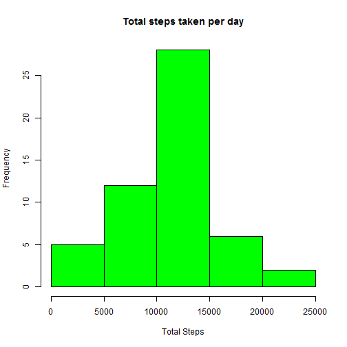
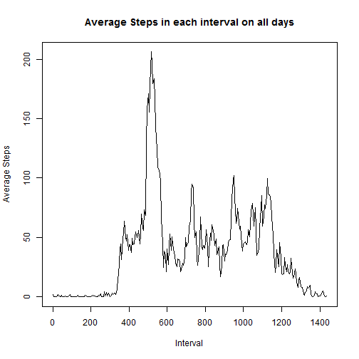
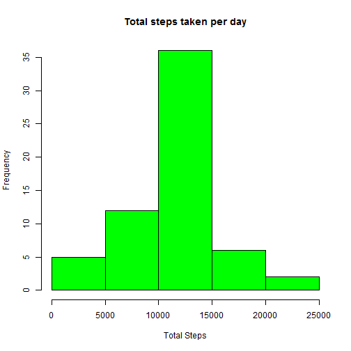
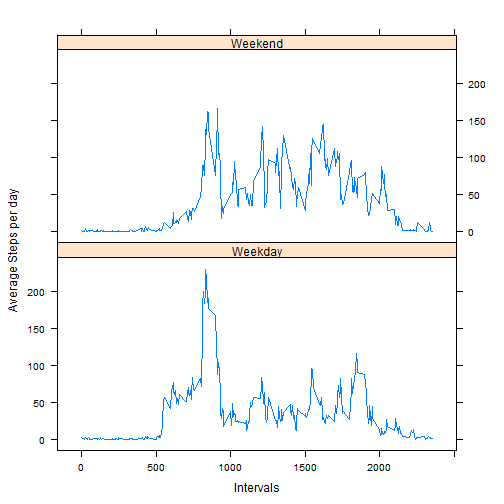

#### Data Source

**Dataset is ** [Available here] (https://d396qusza40orc.cloudfront.net/repdata%2Fdata%2Factivity.zip)

**It contains 17,568 observations for following variables**


* _steps_: Number of steps taking in a 5-minute interval (missing values are coded as NA)

* _date_: The date on which the measurement was taken in YYYY-MM-DD format

* _interval_: Identifier for the 5-minute interval in which measurement was taken

#### Loading dependencies


```r
library(sqldf)
library(lattice)
```

#### Loading and preprocessing the data


```r
input_data <- read.csv("activity.csv", header = TRUE, sep = ",")
input_data_1 <- input_data
calc_interval <- rep(seq(from = 0, to = 1435, by = 5), times = 61)
input_data_1 <- cbind(input_data_1, calc_interval)
```

##### Mean total number of steps taken per day (Ignoring NAs for this part)

**1.  Calculate the total number of steps taken per day**


```r
total_steps <- sqldf("select date, sum(steps) as 'Total_Steps'
                                      from input_data_1 
                                      group by date")
total_steps_no_NA <- subset(total_steps, total_steps$Total_Steps != 'NA')
total_steps_no_NA$Total_Steps <- as.numeric(total_steps_no_NA$Total_Steps)
```

**2. Plot a histogram of the total number of steps taken each day**


```r
hist(total_steps_no_NA$Total_Steps, 
     col = "green", 
     main = "Total steps taken per day", 
     xlab = "Total Steps")
```

 

**3.  Calculate and report the mean and median of the total number of steps taken per day**


```r
mean_steps <- mean(total_steps_no_NA$Total_Steps)
print(paste("Mean of total steps taken per day :", mean_steps))
```

```
## [1] "Mean of total steps taken per day : 10766.1886792453"
```

```r
median_steps <- median(total_steps_no_NA$Total_Steps)
print(paste("Median of total steps taken per day :", median_steps))
```

```
## [1] "Median of total steps taken per day : 10765"
```

##### Average daily activity pattern (Not removing NAs for this part)


```r
average_steps <- sqldf("select interval, calc_interval, avg(steps) as 'avg_steps'
                                      from input_data_1 
                                      group by interval, calc_interval")
```

**1. Prepare a time series plot (i.e. type = "l") of the 5-minute interval (x-axis) and the average number of steps taken, averaged across all days (y-axis)**


```r
plot(average_steps$calc_interval, 
     average_steps$avg_steps, 
     type = "l", 
     main = "Average Steps in each interval on all days",
     ylab = "Average Steps", 
     xlab = "Interval"
)
```

 

**2.  Identify 5-minute interval containing the maximum number of steps, on average across all the days in the dataset**


```r
x <- (sqldf("select interval, calc_interval 
             from average_steps 
             where avg_steps = (select max(avg_steps) from average_steps)"))

print(paste("Maximum average steps taken in Interval: " , x[[2]]))
```

```
## [1] "Maximum average steps taken in Interval:  515"
```

#####Imputing missing values

**1.  Calculate and report the total number of missing values in the dataset (i.e. the total number of rows with NAs)**


```r
total_NA <- sum(is.na(input_data$steps))
print(paste("Total Number of Missing Values: ", total_NA))
```

```
## [1] "Total Number of Missing Values:  2304"
```

**2. Strategy for filling in all of the missing values in the dataset.**


```r
NA_steps <- subset(input_data, is.na(input_data$steps))
valid_steps <- subset(input_data, !(is.na(input_data$steps)))

NA_substitute <- merge(NA_steps, average_steps, by.x = "interval", by.y = "interval")
NA_substitute <- NA_substitute[, c(5, 3, 1)]

names(NA_substitute) <- names(valid_steps)
```

**3.  Create a new dataset that is equal to the original dataset but with the missing data filled in**


```r
fixed_dataset <- rbind(valid_steps, NA_substitute)
fixed_dataset <- fixed_dataset[ order(fixed_dataset$date), ]
```

**4. Make a histogram of the total number of steps taken each day and Calculate and report the mean and median total number of steps taken per day. **


```r
fixed_total_steps <- sqldf("select date, sum(steps) as 'Total_Steps'
                     from fixed_dataset
                     group by date")


hist(fixed_total_steps$Total_Steps, 
     col = "green", 
     main = "Total steps taken per day", 
     xlab = "Total Steps")
```

 

```r
fixed_mean_steps <- mean(fixed_total_steps$Total_Steps)
print(paste("Mean of total steps taken per day after imputing missing data :", fixed_mean_steps))
```

```
## [1] "Mean of total steps taken per day after imputing missing data : 10766.1886792453"
```

```r
fixed_median_steps <- median(fixed_total_steps$Total_Steps)
print(paste("Median of total steps taken per day after imputing missing data :", fixed_median_steps))
```

```
## [1] "Median of total steps taken per day after imputing missing data : 10766.1886792453"
```


##### Differences in activity patterns between weekdays and weekends

**1.  Create a new factor variable in the dataset with two levels - "weekday" and "weekend" indicating whether a given date is a weekday or weekend day.**


```r
fixed_dataset$day_type <- as.factor(ifelse(weekdays( as.Date(fixed_dataset$date) )
                                           %in% c("Saturday","Sunday"), "Weekend", "Weekday")) 
```

**2.  Make a panel plot containing a time series plot (i.e. type = "l") of the 5-minute interval (x-axis) and the average number of steps taken, averaged across all weekday days or weekend days (y-axis). **


```r
fixed_average_steps <- sqldf("select interval, day_type, avg(steps) as 'avg_steps'
                       from fixed_dataset
                       group by interval, day_type")


xyplot(fixed_average_steps$avg_steps ~ fixed_average_steps$interval
      | levels(fixed_average_steps$day_type), 
       data = fixed_average_steps,
       type = "l",
       xlab = "Intervals",
       ylab = "Average Steps per day",
       layout=c(1,2))
```

 
